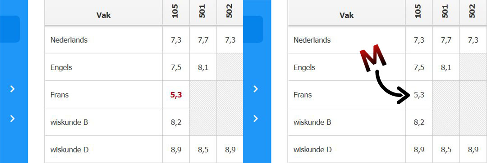

# Roodloos
>Roodloos is een Chrome/Firefox-extensie die onvoldoendes op Magister.net zwart kleurt. Zo vallen ze minder op.

Geïnspireerd door een artikel van Rixt Hofenk op [Scholieren.com](https://www.scholieren.com/blog/onvoldoende-liever-niet-in-het-rood) waarin ze schreef dat 'na het halen van een onvoldoende haar cijferlijst eruit ziet als een slagveld', bedacht ik Roodloos. 



### Wat doet Roodloos?
Roodloos is een simpele extensie voor Chrome en Firefox die dit probleem oplost. De extensie maakt alle rode onvoldoendes zwart. Hierdoor kijk je nooit meer tegen een slagveld aan. Da's wel zo prettig.

### Wat doet Roodloos niet?
Roodloos is geen helaas geen toverstaf of magische methode om van je onvoldoendes af te komen.

Roodloos...
- past je cijfers niet aan;
- 'hackt' je Magister niet;
- zorgt er niet voor dat je ouders minder boos worden;
- past geen pagina's aan van personen die de extensie niet hebben geïnstalleerd;
- werkt niet in de Magister-app.

## Installatie

Roodloos wordt op dit moment ingediend om in de Chrome Web Store en de Firefox add-ons-library te verschijnen.

Je kunt de extensie nu al handmatig installeren. Download het zip-bestand van de laatste versie.

**Chrome:** <br>
Ga naar [`extensies`](chrome://extensions/) en activeer `Ontwikkelaarsmodus`. Druk dan op `Uitgepakte extensie laden` en navigeer naar de downloadlocatie op je computer. Druk op `selecteren` en je hebt de extensie succesvol geïnstalleerd!

**Firefox:** <br>
Ga naar [`add-ons`](about:addons) en klik op het instellingenpictogram. Selecteer `Add-ons debuggen` en klik daarna op `Tijdelijke add-on laden...`. Upload een zip-bestand met als inhoud de zojuist gedownloade map (`nl_NL`).

## Werking

```python
xxx
```

## Licentie
[MIT](LICENSE)
